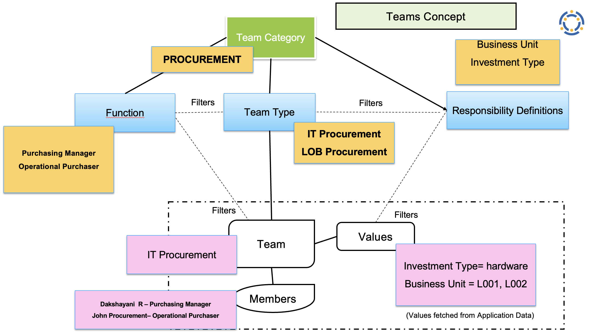

# Focus on Issues in Your Business : Responsibility Management Use Cases

## Description

Model Enterprise Responsibilities for a Business User in Cloud - BTP

## Overview

Come and experience how Responsibility Management service in BTP is now helping BTP app to model enterprise responsibilities for a user easily. With it’s strong Query APIs and easy modelling of data , the RM service will soon become the central place for responsibility modelling for business user

## Requirements

The requirements to follow the exercises in this repository are...

## Exercises

Provide the exercise content here directly in README.md using [markdown](https://guides.github.com/features/mastering-markdown/) and linking to the specific exercise pages, below is an example.

- [Getting Started](exercises/ex0/)
- [Exercise 1 - Create Situation Object](exercises/ex1/)
    - [Exercise 1.1 - Create a Responsibility Management Team](exercises/ex1#exercise-11-sub-exercise-1-description)

**OR** Link to the Tutorial Navigator for example...

Start the exercises [here](https://rm-testing-d6p36k0t-responsibility-management-development.cfapps.sap.hana.ondemand.com/cp.portal/site).

**IMPORTANT**

Your repo must contain the .reuse and LICENSES folder and the License section below. DO NOT REMOVE the section or folders/files. Also, remove all unused template assets(images, folders, etc) from the exercises folder. 

## Contributing
Please read the [CONTRIBUTING.md](./CONTRIBUTING.md) to understand the contribution guidelines.

## Code of Conduct
Please read the [SAP Open Source Code of Conduct](https://github.com/SAP-samples/.github/blob/main/CODE_OF_CONDUCT.md).

## How to obtain support

Support for the content in this repository is available during the actual time of the online session for which this content has been designed. Otherwise, you may request support via the [Issues](../../issues) tab.

## License
Copyright (c) 2023 SAP SE or an SAP affiliate company. All rights reserved. This project is licensed under the Apache Software License, version 2.0 except as noted otherwise in the [LICENSE](LICENSES/Apache-2.0.txt) file.
